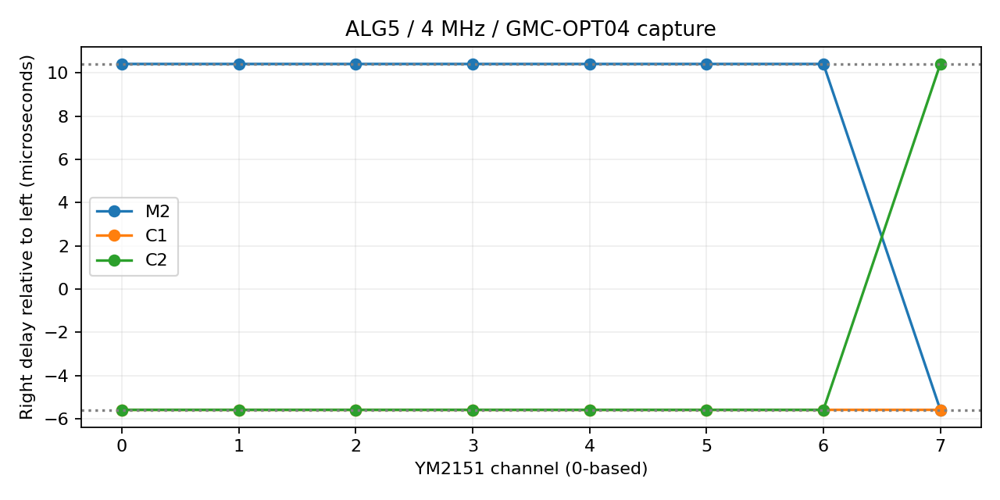

# 4MHz録音によるALG5出力タイミングの測定と0.8実装

単独キャリアでは、右の遅延が約+10.418µsと−5.584µsの2群に分かれます。差は約16.002µsで、64/4MHz=16µsにほぼ一致します。正は右が遅い、負は右が先行する意味です。

|ch|M2|C1|C2|
|---|---:|---:|---:|
|0|+10.41817|-5.58358|-5.58391|
|1|+10.41789|-5.58343|-5.58383|
|2|+10.41807|-5.58351|-5.58389|
|3|+10.41790|-5.58359|-5.58380|
|4|+10.41782|-5.58349|-5.58429|
|5|+10.41809|-5.58354|-5.58398|
|6|+10.41839|-5.58365|-5.58404|
|7|-5.58347|-5.58348|+10.41829|



01SOLOのch0でもM2 +10.41883µs、C1 −5.58345µs、C2 −5.58421µs。02LIVEのキーオンを維持した単独区間でもそれぞれ+10.41913、−5.58234、−5.58127µsです。03CHSCANの単独区間の帯域内残差RMSは約0.0022〜0.0032%でした。これは左右間の遅延モデルの適合度であり、音源コアと実機の一致率ではありません。

## 測定方法と再実行

96kHzの左右信号に同一Hann窓を掛け、100Hz〜15kHzかつ左最大スペクトル振幅の2.5%以上のビンについて、R(f)=g L(f) exp(−j2πfτ)を最小二乗で当てはめました。gは実数、τは±50µsから探索。無音区間から01/03の発音区間を自動検出し、順にMDX区間へ対応付けています。立上り150ms、終端100msを除外。02は実測開始約0.15秒とMDXの4.194304秒周期で区切り、境界近傍を同様に除外しています。数値の小数桁は推定出力であり、絶対クロック精度・統計的信頼区間を保証しません。

```
python -m pip install numpy scipy
python measurements-4mhz/analyze.py /path/to/recordings --output metrics.json
```

入力名は01SOLO.wav、02LIVE.wav、03CHSCAN.wav。metrics.jsonには時刻、遅延、選択帯域内残差、解析窓内のフルスケール近傍サンプル数を収録。02/03のファイル全体はフルスケールに到達するため、混合音の振幅を完全一致の根拠にはしていません。

## 実装

`set_measured_alg5_timing(true)`を追加しました。ALG5に限定し、全chの左に各キャリアの前回値、右にはch0〜6のM2のみ前回値、ch7のC2のみ前回値を採用します。他の右キャリアは今回値です。相対的に1内部サンプル先行する関係を、未来の値を使わず再現します。FM変調経路や位相計算は変更していません。

共通の約10.418µsは1/96000秒に近いため、CLIの`--gmc-opt04-4mhz`はリサンプル後の右を1出力フレーム遅らせます。この共通遅延をチップ固有定数とはしていません。CLIは4MHz・96kHzを必須とし、APIはキャリアのフレーム選択だけを行います。既定では無効で、従来の任意マスク指定も利用できます。任意マスクが非ゼロのchはそちらが優先され、resetは測定モードを解除します。

```
bin/opm_render hardware-tests/traces/01SOLO.trace model.wav 21 4000000 96000 0.7 --gmc-opt04-4mhz
```

生成WAVを同じスペクトル法で検査した単独区間の遅延はM2 +10.41671µs、C1 −5.58327µs、C2 −5.58408µsでした。

同梱01SOLO_model.wavはこのコマンドによる機能コアの試聴用出力です。実機との音色・波形一致を達成した録音ではありません。

## 解釈と残る検証

ch7だけ群分けが変わる結果は、順番に処理する演算または出力転送の境界をまたいで左右のフレームが分かれる仮説と整合します。しかし、32オペレータの演算スロット順、内部加算器のラッチ位置、GMC-OPT04の取り込み位置のどこが原因かは、この音声だけでは一意に復元できません。今回は観測された入出力関係を実装したもので、内部時分割回路の完全再現ではありません。異なるキャリアの左右位相差がビートの山谷をずらすため、全体への単一遅延で得られないステレオ変化が生じます。

次の検証には既存05SINE.MDX（M1を含む全OP・全ch）と04PITCH.MDX（音程依存）を同じ4MHzで録音すると有効です。現時点で他ALGや他クロックへの適用は未検証です。

## 前回測定音色の訂正

前回生成器のM1行は(31,7,0,7,15,17,0,0,0,0,0)、M2行は(24,12,0,7,1,0,0,1,0,0,0)でした。元の提示値はM1=(31,15,3,0,3,17,0,1,3,0,0)、M2=(28,12,0,7,1,0,0,3,0,0,0)です。C1/C2は一致しています。「提供音色そのまま」という前回説明は誤りでした。今回の録音との対応を保つため01〜07の既存データは変更せず、診断音色として説明を訂正しました。元音色そのものの完全再現を検証したとは扱いません。
