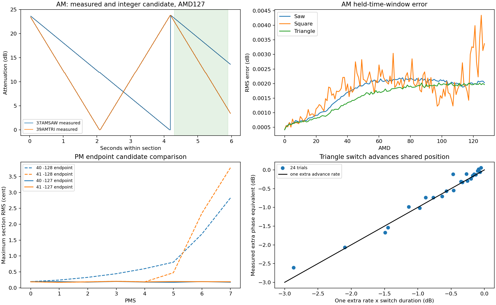

> 置き換え前の測定報告です。現行実装は../../docs/PERIODIC_REPLACEMENT.mdを参照してください。

# LFO追加実機録音37～42：検証報告（0.11bに対する測定資料）

対象：G.I.M.I.C、YM2151設定4 MHz、光デジタル出力の96 kHz/24bitステレオ録音。2026-09-15。

## 結論

6本すべての予定区間を確認し、AM 384条件、PM 256条件、状態変更96試行を解析した。録音欠落はない。波形・深度計算と定常の進み方について、独立した実装仕様に使える具体的な候補を得た。

- AM：3波形×AMD全128値、AMS1において、整数の積を128で割り切り捨てるモデルを支持。比較区間の314,361点に、減衰1段の半分以上の誤差はなかった。
- PM：鋸歯状・三角波×PMS全8値×PMD選択16値で、符号と絶対値を分けた整数深度計算が実測と整合した。鋸歯状PMの負側は−128開始より−127開始が合う。
- FREQ：81h・87h・8Fhの96区間で、既存の低速実測から得た4ビット反転順の追加段規則が、保留4,153段に不一致0で一致した。
- 状態変更：同値/異値のFREQ書き込みで波形位置全体は先頭に戻らない。保持では最大減衰側へ戻る。三角波を選んでいる間、共有位置が約2倍の速さで進むことを支持する。

**これは内部の全ビット・全クロックの完全同定ではない。** 時刻合わせ、音程応答の実測表、区間ごとの位相推定を使っており、レジスタ列のみを入力して録音全体を無調整で再現した検証ではない。本成果物は検証資料と測定モデルであり、エミュレータ本体の改版や、全体の0BSD単独化を行った成果物ではない。

Copyright (C) 2026 by I.C.KaZe


## 入力と収録範囲

|番号|採用ファイル|録音全長 秒|測定音区間 秒|条件・試行|
|---|---|---:|---:|---:|
|37|37AMSAW.flac|776.874667|768.614|AMD 128条件|
|38|38AMSQR.flac|774.144000|768.593|AMD 128条件|
|39|39AMTRI.flac|774.144000|768.626|AMD 128条件|
|40|40PMSAW.flac|774.144000|768.594|PMS×PMD 128条件|
|41|41PMTRI.flac|773.521479|768.602|PMS×PMD 128条件|
|42|42STATE.flac|222.833333|216.476|96試行、各4区間|

すべて96,000 Hz、2ch、24bit。42は再送版を採用した。入力のSHA-256、バイト数、ffprobe情報をinputs.jsonに保存した。MDXの待ち時間に対する測定区間の時間倍率は約0.999983～1.000049で、途中打ち切りを示すものではない。

基準チャンネルの連続発音の始点・終点から、公称MDX時刻に線形の時間合わせを行った。そのため、時刻合わせ後のMDXとの一致を、実際の書き込み時刻やマスタークロックの独立検証には数えない。

## 抽出方法と信頼できる範囲

96 kHzを保ったまま、4秒ブロックに前後0.5秒の余白を付けて解析信号を求めた。振幅と位相微分を1 msごとに平均して保存し、設定変更直後と、推定した段差境界から4 ms以内を比較から除いた。12 kHzへの音声ダウンサンプリングはしていない。

別方式による確認として、37/39/41の計36か所で、元の96 kHz音声の8 ms区間へ基本波・第2/第3高調波・直流項を最小二乗で当てはめた。native_check.jsonに両方式の差を記録した。これは抽出誤差の点検であり、SRCを完全に逆算したという意味ではない。

1 ms点は互いに相関を持つ音響測定点であり、独立した内部ビット数ではない。デジタル録音でもSRC後の音声であり、内部の生の数値をビット完全に取得できたとは扱わない。

## AM：波形と深度

定常周期の256位置を i=0..255 と表したとき、次の観測モデルが合う。iの原点は区間内で調整しており、リセット直後の1クロック単位の定義ではない。

```
鋸歯状 W(i) = 255 - i
矩形   W(i) = i < 128 ? 255 : 0
三角   W(i) = i < 128 ? 255 - 2*i : 2*i - 256

AM単位 = floor(W(i) * AMD / 128)   // 今回はAMS1
```

AM単位から音声減衰への係数は、矩形波の偶数AMDの高減衰側から約0.09408931 dB/単位と推定した。この係数は音響上の較正値であり、内部の正確な対数テーブル値として固定する根拠ではない。

段差間隔は37の高深度の段差時刻から約16.381957 ms、一周約4.193781秒と推定した。録音装置側の時計との相対測定値であり、4 MHzからの厳密分周定義をこの小数値へ変更する提案ではない。

各区間の先頭4.05秒までで位相を合わせ、4.3～5.9秒を比較した。候補比較には切り捨て/四捨五入/切り上げ、三角波の端点違いを含めた。最終比較は全深度で共通の上記式を固定している。

|波形|比較点数|区間RMS中央値 dB|区間RMS最大 dB|半段以上の誤差|
|---|---:|---:|---:|---:|
|鋸歯状|104,763|0.001995|0.002200|0|
|矩形|104,772|0.001899|0.004343|0|
|三角|104,826|0.001742|0.002025|0|

低AMDでは長い一定値があるため、初期の「誤差中央値だけ」で位相を合わせる方法では位相候補を区別できず、比較区間に1段のずれが残った。最終版では、訓練区間全体のクリップ付き平均絶対誤差を使い、式を変えずにこの曖昧さを解消した。初期結果am_fit.jsonと最終結果am_fixed.jsonを区別して収録した。

**0.11bとの具体的な差：矩形AMの高側256は、この録音が支持する255と異なる。** AMDが1以上なら、256モデルの出力は2×AMD、255モデルは2×AMD−1で、1減衰単位の差になる。単に波形の概形が似ているという比較ではない。

三角波の式はリセットから定常再生した系列に対するもの。波形切り替えで別の内部位置系列へ入ったときの全端点まで、この3本だけで検証したものではない。AMS2/3の内部丸めについても、今回の3本は直接の測定対象ではない。

## PM：波形、深度、音程計算の切り分け

支持された定常波形の候補：

```
鋸歯状 P(i) = i < 128 ? i : i - 255
三角 P(i) =
    i < 64  : 2*i
    i < 128 : 255 - 2*i
    i < 192 : 256 - 2*i
    その他  : 2*i - 511

m = floor(abs(P(i)) * PMD / 128)
PMS0    : q = 0
PMS1～5 : abs(q) = m >> (6 - PMS)
PMS6～7 : abs(q) = m << (PMS - 5)
qの符号 = P(i)の符号
```

qは音程計算へ渡す整数変位の候補であり、セント数そのものではない。qをそのまま一定のセント倍率で出力すると、実機の音程量子化との差をLFOの誤差として混同する。

そこで40の選択した半数の深度の先頭周期から、qに対する実測音程応答表を作った。位相は各条件の先頭1.9秒の正側から合わせた。表作成に使わない40の残り半数と41全条件は、2.2～5.9秒を比較し、負側も評価した。表作成に使った40の条件は4.3～5.9秒だけを比較した。

|候補|40の区間RMS最大 cent|41の区間RMS最大 cent|
|---|---:|---:|
|鋸歯状負側が−128開始|2.827521|3.777304|
|鋸歯状負側が−127開始|0.200151|0.204478|

−127開始の候補で、40は173,567点、41は242,283点を評価した。41の32点は訓練側に同じqの音程応答がなく、補間で成功扱いにせず除外した。

最終候補の区間RMS中央値は40が0.150775 cent、41が0.154807 cent。PMS0でも抽出上の揺らぎがあるため、残差をすべて内部演算の違いと解釈しない。

これは従来の「整数丸めが未確定」という状態から大きく進んだ。ただしPMDは16値、キャリア音程は固定であり、全PMD・全音程の内部演算を一意に復元したという結果ではない。音程応答表自体を汎用のエミュレータ用テーブルとして移植することも提案しない。今回の新規録音では矩形PMとランダムPMを測定していない。

候補選択にも比較結果を使っているため、これは係数推定と分離した比較検証であり、選択後に新しく届いた別録音での最終独立確認とは区別する。過去の参照履歴をなくした完全な情報遮断クリーンルーム作業とも主張しない。既存エミュレータを数値の正解生成器には使っていない。

## 42STATE：定常の追加段と書き込み時の挙動

### 定常部分

96試行の各ベースラインから段差列を抽出した。各区間の先頭16段で未知の位相pを選び、それ以降を比較した。

```
L = FREQ & 15
追加段[n] = reverse4((p+n) & 15) < L
進む量[n] = 1 + 追加段[n]
```

|候補|位相合わせ部分の不一致|保留部分の不一致|保留段数|
|---|---:|---:|---:|
|4ビット反転順の比較|0|0|4,153|
|単純な小数アキュムレータ|192|516|4,153|

対象は81h・87h・8Fh。以前の00h～1Fhの測定に対する規則を、新しい周波数と録音で検証できた。state_steps.jsonにはすべての検出時刻・変化量・位相と不一致数を収録した。現在のLfoClockにある単純なfraction加算は、平均周期が合ってもこの追加段列の正解にはならない。

### 状態変更

|操作|24試行から読み取れる動作|まだ断定しない部分|
|同値FREQ書き込み|AM波形位置を先頭へ戻す動作ではない|分周器が再始動する正確なクロック、残り時間の扱い|
|異値FREQ書き込み|波形位置を保ちながら速度が変わることと整合|下位カウンタ/追加段位相の継承規則|
|01h bit1保持・解除|最大減衰側へ戻り、解除後に再び進むことと整合|保持中にどの内部カウンタが動くか、短い保持の厳密な受理時刻|
|三角波へ一時変更後、鋸歯状へ戻す|通常進行に加えて、切り替え時間に相当する進行が残る|切り替え瞬間の全内部位置と全端点|

三角波切り替えでの追加進行を、切り替え前の減衰速度×切り替え時間と比較した回帰の傾きは約0.9854、切片約0.0317 dB。共有位置が三角波選択中に約2倍速になる候補を支持する。傾きが内部回路の厳密値0.9854という意味ではない。

同値FREQ書き込みの連続性残差は概ね−0.066～+0.178 dB。この程度の差から「完全に無作用」「分周器だけリセット」などをクロック精度で断定しない。短い操作は8.192 ms程度であり、公称MDX時刻・実受理時刻・SRCの遅延を分けていない。保持中の全点が高減衰でなかった短区間も、直ちに回路の例外とは扱わない。

## 参照由来部分との対応と残作業

以下は0.11bが参照由来として宣言している範囲の対応であり、パッケージ全ファイルの権利を新規に保証する監査ではない。

|範囲|今回得られた置き換え根拠|残作業|
|include/ym2151.hpp : LfoClock|平均周期の過去測定、追加段の反転順を新しい96区間で確認|書き込み/保持をまたぐカウンタの遷移、未測定周波数の段列への一般化を明示して新規実装|
|同 : lfo_value|3波形AM、鋸歯状/三角PMの定常整数候補|矩形PM・ランダム・切り替えで現れる位置の根拠を別管理し、参照由来実装を撤去|
|src/ym2151.cpp : 深度処理|AMの積と切り捨て、PMの符号/整数感度処理|実機の音程変換とLFO計算を分離して組み込み、AMS2/3等の根拠を整理|
|同 : write_register / synthesize の状態処理|位相の保持/再設定と三角波時の進行を音声上で確認|未確定部分を明示し、レジスタ列全体での連続予測を検証|
|tests/reference_lfo.cpp、run_reference_check.py、関連LFOテスト|本報告の測定条件・結果を回帰試験の入力にできる|既存参照比較テストを独自試験へ置換し、参照同梱物も含めて再点検|

**計測結果が得られたことだけで、残存する参照コードが独自コードへ変わるわけではない。** 独立モデルを実装する際、確定していない状態遷移を暫定仕様として明示する選択は可能である。「完全一致を証明できないので独立実装自体が一切できない」という意味ではない。

この解析コード・報告・測定モデルは0BSDとして提供する。エミュレータ全体の0BSD単独化を宣言するものではなく、既存の許諾表示を削除する変更も行っていない。

## 追加録音についての判断

今回の6本の欠落や品質不良を理由に、同じ録音をやり直す必要はない。

残る課題に対して「さらに同種のMDXを広く録音すれば必ず完了する」とは言わない。全状態遷移を確定するには、実際にYM2151が受理した01h/18h/1Bh等の書き込みとマスタークロックの対応、リセット解除時刻、可能ならSRC前のデジタル出力が有効である。ホスト側の送信要求時刻だけでは代用できない。G.I.M.I.Cでその記録が取得可能かは、この録音からは判断できない。

波形/深度をさらに限定検証するなら、未測定のPMD・AMS2/3・別音程・矩形PMが対象になる。ただし以前の15/16等にも該当条件があり、今回それらの元音声を再抽出したわけではない。既存の測定結果と区別し、既存録音で足りるものを新たな録音要件にしない。今回の判明事項だけを理由に、追加MDXや再録音を要求しない。

## 再実行

同梱のstimulusには実際に使用したMDX・区間表・レジスタ列を入れた。音声は容量のため重複同梱していない。ZIPを展開した親ディレクトリにuploadを作り、inputs.jsonにある採用ファイル名で6本を置く。

Python 3、NumPy、SciPy、Matplotlib、ffmpeg/ffprobeが必要。解析で使用したNumPyは2.3.5、SciPyは1.17.0。依存ライブラリのコードは同梱していない。

```
python followup-verification/extract.py
python followup-verification/analyze.py
python followup-verification/am_fit.py
python followup-verification/am_fixed.py
python followup-verification/pm_fit.py
python followup-verification/pm_endpoint127.py
python followup-verification/state_fit.py
python followup-verification/state_steps.py
python followup-verification/native_check.py
python followup-verification/make_report.py
```

extract.pyは各FLACのSHA-256を再計算する。既存NPZを再利用するため、別録音に差し替える場合は同番号のNPZを削除してから実行する。中間NPZは約106 MiB。生の96 kHzを一時展開する際は1本あたり約600 MiBを追加使用する。

measurement_model.pyは採用候補式の読みやすい実装である。完全な発振器、レジスタ遷移モデル、音程変換、全波形対応のエミュレータではない。


